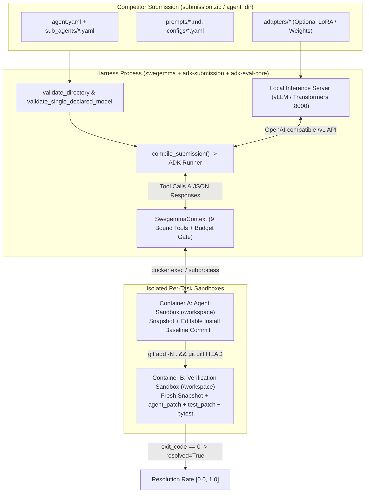
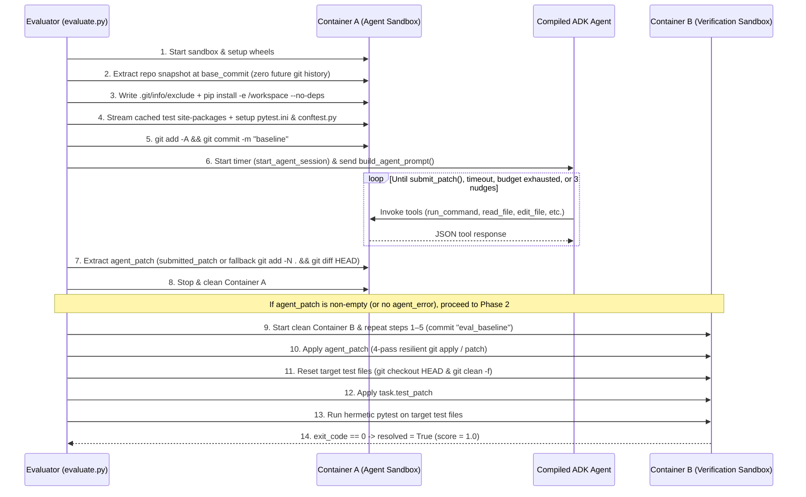

# `swegemma` Evaluation Harness & Competitor Guide

This document provides a complete technical reference for the **`swegemma`** evaluation harness and its companion libraries (**`adk-submission`** and **`adk-eval-core`**). It explains how competitor submissions are validated and compiled, how the harness orchestrates agent sessions and sandboxes, how the built-in tools behave, and how generated patches are extracted and graded.

---

## Table of Contents

1. [System Architecture & Library Stack](#1-system-architecture--library-stack)
2. [Submission Contract & Declarative Agent Schema (`adk-submission`)](#2-submission-contract--declarative-agent-schema-adk-submission)
3. [Model Registry, Single-Model Rule & LoRA Adapters on 4x L4 GPUs](#3-model-registry-single-model-rule--lora-adapters-on-4x-l4-gpus)
4. [Two-Phase Evaluation Lifecycle](#4-two-phase-evaluation-lifecycle)
5. [Harness-to-Agent Interaction Protocol](#5-harness-to-agent-interaction-protocol)
6. [Built-In Tools Reference (`swegemma.tools`)](#6-built-in-tools-reference-swegemmatools)
7. [Budgets, Operational Limits & Context Management](#7-budgets-operational-limits--context-management)
8. [Patch Extraction & Phase 2 Verification (`verify_task`)](#8-patch-extraction--phase-2-verification-verify_task)
9. [Local CLI Usage & Output Artifacts](#9-local-cli-usage--output-artifacts)
10. [Competitor Best Practices & Important Gotchas](#10-competitor-best-practices--important-gotchas)

---

## 1. System Architecture & Library Stack

The evaluation stack is composed of three cooperating libraries:

| Package | Role in the Competition Stack |
| :--- | :--- |
| **`adk-submission`** | **Declarative Agent Compiler & Inference Server Manager.** Compiles untrusted submission directories (`agent.yaml`, prompts, sub-agents, skills, and PEFT/LoRA adapters) into live Google ADK `BaseAgent` trees (`compile_submission`) without executing arbitrary competitor Python code (`importlib` is never used). Also manages the local `VllmServer` and `TransformersServer` processes. |
| **`adk-eval-core`** | **Core Evaluation Infrastructure.** Provides base task/result models (`BenchmarkTask`, `BaseTaskResult`, `EvaluationResult`), sandbox execution backends (`DockerContainer`, `SubprocessSandbox`), resilient 3-tier file editing (`apply_replacement`), token/cost tracking (`TokenBudget`, `PricingTable`), ADK plugins (`EventDisplayPlugin`, `ModelRetryPlugin`), and ATIF v1.7 trajectory tracing (`SessionTrace`). |
| **`swegemma`** | **SWE-bench Harness & Scoring Engine.** Implements the two-container SWE evaluation lifecycle (`Evaluator`, `run_agent_sandbox`, `verify_task`), binds the 9 sandboxed workspace and code-intelligence tools (`SwegemmaContext.create_tools()`), constructs the task prompt and continuation nudges, extracts unified git diffs, and runs hermetic `pytest` verification (`swegemma.metric.score`). |



---

## 2. Submission Contract & Declarative Agent Schema (`adk-submission`)

### 2.1. Declarative-Only Security Model
Competitors **do not** submit Python code entrypoints (`agent.py` or `agent_fn`). Standard ADK's `from_config()` permits arbitrary dynamic Python imports; **`adk-submission` replaces it with a sandboxed YAML compiler (`compile_submission`)**. All agents, sub-agents, workflows, tools, and generation parameters are declared in YAML and resolved against closed host registries (`ToolRegistry`, `ModelRegistry`, `SkillRegistry`, `CallbackRegistry`).

### 2.2. Submission Directory Layout
A valid submission directory (packaged at the root of `submission.zip` or referenced in `submission.csv`) follows this layout:

```text
submission/
├── agent.yaml                  # REQUIRED: Root agent config (or root_agent.yaml; .yml also accepted)
├── configs/
│   └── sampling.yaml           # Optional: Generation parameters loaded via !include
├── prompts/
│   ├── system.md               # Optional: System instructions loaded via !include
│   └── analyzer.md
├── sub_agents/
│   └── code_analyzer.yaml      # Optional: Sub-agent or AgentTool YAML configurations
├── adapters/                   # Optional: Fine-tuned PEFT LoRA adapters or model weights
│   ├── main_lora/
│   │   ├── adapter_config.json
│   │   └── adapter_model.safetensors
│   └── tool_lora/
│       ├── adapter_config.json
│       └── adapter_model.safetensors
└── skills/                     # Optional: ADK Skill directories (each containing SKILL.md)
    └── repo_navigation/
        └── SKILL.md
```

- **Root Config Discovery**: Exactly one root config (`agent.yaml`, `agent.yml`, `root_agent.yaml`, or `root_agent.yml`) must exist in the submission root. Having zero root files raises `MissingRootConfigError`; having more than one raises `MultipleRootConfigsError`.
- **Sandboxed `!include` Directive**: YAML files may embed external files using `!include <relative_path>`:
  - `.md` and `.txt` files are loaded as raw UTF-8 strings (ideal for `instruction` or `global_instruction`).
  - `.yaml` and `.yml` files are parsed recursively (up to a maximum include depth of `10` with cycle detection).
  - Absolute paths, null bytes, `..` traversal components, and symlinks resolving outside the submission root are strictly blocked (`PathTraversalError`).

### 2.3. Supported Agent Classes (`agent_class`)
`SandboxedAgentConfig` supports four discriminated agent types (defaulting to `LlmAgent` if `agent_class` is omitted):

1. **`LlmAgent` (default)**:
   - `name` (`str`, required): Agent identifier string.
   - `model` (`str`, required unless a default model is set): Model alias from the registry (e.g., `gemma-4-31b-it-qat-w4a16-ct`).
   - `adapter` (`str | None`): Optional adapter name matching a subdirectory or weight file under `adapters/`.
   - `description` (`str`, up to `1,000,000` chars): Used by parent agents when delegating to this agent.
   - `instruction` (`str`, up to `1,000,000` chars): System prompt for the agent. Supports ADK session state templating (`{problem_description}`, `{hints}`, or custom `output_key` variables).
   - `tools` (`list`): List of tool names (`str`), `AgentTool` references (`agent_tool: {config_path: ..., skip_summarization: true}`), or inline agent dictionaries.
   - `skills` (`list[str] | None`): List of relative paths to skill directories within the submission archive.
   - `sub_agents` (`list`): List of `{config_path: ...}` references for multi-agent transfer.
   - `output_key` (`str | None`): Saves the agent's final text output into `session.state[output_key]`.
   - `include_contents` (`"default" | "none"`): Controls whether conversation history is passed to the agent.
   - `disallow_transfer_to_parent` / `disallow_transfer_to_peers` (`bool | None`).
   - `generate_content_config` (`dict | None`): Sampling, seed, and thinking parameters (see constraints below).
2. **`SequentialAgent`**:
   - Executes `sub_agents` in sequential order. Accepts `name`, `description`, `sub_agents`, and agent callbacks.
3. **`ParallelAgent`**:
   - Executes `sub_agents` concurrently in isolated branches. Accepts `name`, `description`, `sub_agents`, and agent callbacks.
4. **`LoopAgent`**:
   - Repeatedly executes `sub_agents` up to `max_iterations` (`int`, default `500`, bounded to `1..500`).

### 2.4. Enforced Structural Limits & Generation Constraints
Submission constraints in `swegemma` (`build_submission_limits()` in `swegemma/config.py`) are intentionally minimal: **aside from security sandboxing (no symlinks, no path traversal, declarative YAML only), the primary hard constraint is a total unpacked submission size of `< 3 GiB` (`3,221,225,472` bytes), including all `adapters/` weights**, plus token ceilings required by the 4x L4 GPU context window (`32,768` tokens).

All other structural limits are set to generous safety ceilings solely to guard against runaway recursion or zip/YAML anchor bombs:

| Category | Parameter | Competition Limit / Allowed Range |
| :--- | :--- | :--- |
| **Primary Archive Constraint** | **`max_total_size_bytes`** | **`3 GiB` (`3,221,225,472` bytes total unpacked size, including `adapters/`)** |
| **Structural Safety Ceilings (`SubmissionLimits`)** | `max_file_count` | `10,000` files |
| | `max_yaml_files` | `1,000` YAML files |
| | `max_yaml_size_bytes` | `50 MiB` per YAML file / cumulative `!include` expansion |
| | `max_skill_size_bytes` | `50 MiB` per skill directory |
| | `max_instruction_chars` | `1,000,000` chars per agent (`10,000,000` total across all agents) |
| | `max_agents` | `500` total agents in the compiled tree |
| | `max_sub_agent_depth` | `50` levels of nesting (`sub_agents` and `agent_tool`) |
| | `max_skills` | `1,000` skills |
| | `max_loop_iterations` | `500` iterations for any `LoopAgent` |
| | `allowed_file_extensions` | Strictly required formats only: `.yaml`, `.yml` (agent/eval configs), `.md`, `.txt` (prompts & `SKILL.md`), `.py` (ADK skill scripts), `.json` (`adapter_config.json`), and `.safetensors` (`adapter_model.safetensors`). Pickle-based weights (`.bin`, `.pt`, `.pth`) and other binary/archive extensions are rejected. |
| | `adapter_extensions` | `.safetensors` only (`adapters/<name>/adapter_model.safetensors`) |
| **Generation Config (`GenerationConstraints`)** | `allowed_fields` | **All schema fields permitted**: `temperature`, `top_p`, `top_k`, `max_output_tokens`, `presence_penalty`, `frequency_penalty`, `stop_sequences`, `response_mime_type`, `seed`, `thinking_config` |
| | `max_output_tokens` | `1` to `32,768` (default `16,384`; bounded by 4x L4 vLLM `max_model_len=32768`) |
| | `thinking_config.thinking_budget` | `1` to `32,768` (default `4,096`; bounded by 4x L4 vLLM `max_model_len=32768`; use `include_thoughts: false` or `thinking_level: "NONE"` to disable thinking) |
| | `thinking_config.thinking_level` | `"MINIMAL"`, `"LOW"`, `"MEDIUM"`, `"HIGH"`, or `"NONE"` (case-insensitive) |
| | `thinking_config.include_thoughts` | `true` or `false` |
| | `temperature` / `top_p` / `top_k` / penalties / `seed` / `stop_sequences` | Unrestricted (any valid schema value; `temperature >= 0.0`, `0.0 <= top_p <= 1.0`, `top_k >= 1`) |

> [!WARNING]
> Execution-altering ADK fields that bypass the sandbox (`tools`, `system_instruction`, `http_options`, `safety_settings`, or `response_schema` inside `generate_content_config`) are excluded from `GenerateContentConfig` by schema design and will raise a validation error if set.

---

## 3. Model Registry, Single-Model Rule & LoRA Adapters on 4x L4 GPUs

### 3.1. Computational Environment: 4x NVIDIA L4 GPUs (96 GB Total VRAM)
The competition evaluation environment runs on a dedicated machine equipped with **4 × NVIDIA L4 GPUs**:
- **Per-GPU Memory**: `24 GB GDDR6` (`96 GB` total VRAM across 4 GPUs).
- **vLLM Serving Configuration (`setup_vllm_server`)**:
  - `tensor_parallel_size = 4` (shards model weights and KV cache across all 4 L4 GPUs)
  - `gpu_memory_utilization = 0.90` (`~21.6 GB` usable per GPU / `~86.4 GB` usable across 4 GPUs)
  - `max_model_len = 32768` (`32,768` tokens maximum combined prompt + reasoning + output context length)
  - `enable_lora = True`, `max_loras = 8`, `max_lora_rank = 128`

| Base Model Variant | Weight Precision | Approximate Weight Footprint (4 GPUs) | Remaining VRAM for 32k KV Cache + CUDA Graphs + LoRAs |
| :--- | :--- | :--- | :--- |
| **`gemma-4-31b-it-qat-w4a16-ct`** *(Default)* | W4A16 (INT4 Quantized) | `~16–18 GB` (`~4.5 GB / GPU`) | `~68 GB` (`~17.0 GB / GPU`) — Fast startup & high KV headroom |
| **`gemma-4-31b-it` / `gemma-4-27b-it`** | `bfloat16` | `~54–62 GB` (`~13.5–15.5 GB / GPU`) | `~24–32 GB` (`~6.0–8.0 GB / GPU`) — Tight VRAM budget |
| **`gemma-4-26b-a4b-it`** *(MoE)* | `bfloat16` | `~52 GB` (`~13.0 GB / GPU`) | `~34 GB` (`~8.5 GB / GPU`) |
| **`gemma-4-12b-it` / `gemma-4-9b-it`** | `bfloat16` | `~18–24 GB` (`~4.5–6.0 GB / GPU`) | `~62–68 GB` (`~15.5–17.0 GB / GPU`) |

This 4x L4 hardware budget directly governs four operational rules:
1. **Single Base Model Per Submission**: Because 96 GB of aggregate VRAM cannot simultaneously host two large models alongside their 32k KV caches, all agents in a submission must share **one** declared base model.
2. **Context Window Ceiling (`32,768` tokens)**: `max_output_tokens` and `thinking_budget` cannot exceed `32,768` tokens, matching vLLM's `max_model_len=32768`.
3. **Total Unpacked Submission Size (`< 3 GiB` including `adapters/`)**: Ensures rapid extraction into `/kaggle/working/submission` and guarantees that submitted LoRA adapters fit within host disk and GPU LoRA buffers (`max_loras=8`, `max_lora_rank=128`).
4. **Host Container Sandboxing (`4 GiB` RAM / `2 vCPUs` per container)**: Prevents repository test suites inside `Container A` and `Container B` from starving the host CPU or system RAM needed by the vLLM engine.

### 3.2. The Single Base Model Rule
Before launching the inference server, `validate_single_declared_model(agent_dir)` traverses the root `agent.yaml`, every referenced `sub_agents[*].config_path`, every `tools[*].agent_tool.config_path`, and any standalone agent YAML files in the submission directory.
- Provider prefixes (`openai/`, `google/`, `hosted_vllm/`, `custom/`) are stripped (`normalize_model_name`).
- **All agents in a submission must declare at most ONE unique base model** (`len(models) == 1`). Declaring two different base models (e.g., `gemma-4-31b-it` in the root agent and `gemma-4-9b-it` in a sub-agent) raises `ParticipantVisibleError`.

### 3.3. Pre-Registered Model Aliases & Routing
`setup_gemma_model_registry()` registers the following Gemma 4 aliases in `ModelRegistry`:
- `gemma-4-31b-it-qat-w4a16-ct` (Starter Kit default)
- `gemma-4-31b-it`, `gemma-4-31b`
- `gemma-4-27b-it`, `gemma-4-27b`
- `gemma-4-26b-a4b-it`, `gemma-4-26b-a4b`, `diffusiongemma-26b-a4b-it`
- `gemma-4-12b-it`, `gemma-4-12b`
- `gemma-4-9b-it`, `gemma-4-9b`
- `gemma-4-e4b-it`, `gemma-4-e4b`
- `gemma-4-e2b-it`, `gemma-4-e2b`

When the scoring harness starts the local inference server (`VllmServer` by default on `127.0.0.1:8000` with `tool_call_parser='gemma4'`, `reasoning_parser='gemma4'`, `max_model_len=32768`), `setup_gemma_model_registry` binds the declared model alias to `LiteLlm(model=f"openai/{served_model}", api_base="http://127.0.0.1:8000/v1", num_retries=5)`.

### 3.4. Multi-LoRA Serving (`adapters/`) & Sizing Guidelines
Even though a submission is restricted to a single base model, **different agents in your hierarchy can use different fine-tuned LoRA adapters**:
1. Place PEFT LoRA directories (containing `adapter_config.json` and `adapter_model.safetensors`) inside `adapters/<adapter_name>/`.
2. Reference `adapter: <adapter_name>` on any `LlmAgent` in `agent.yaml` or `sub_agents/*.yaml` (for example, `adapter: main_lora` on the root coder agent and `adapter: tool_lora` on a read-only analyzer `AgentTool`).
3. `discover_adapters()` automatically registers each adapter with the vLLM server (`enable_lora=True`, `max_loras=8`, `max_lora_rank=128`), and `resolve_swegemma_adapter` routes requests from each agent to its respective `openai/<adapter_name>` endpoint.
4. **Adapter Size Planning (`< 3 GiB` total budget)**:
   - For a 31B model in `bfloat16` targeting all linear projections (`q_proj`, `k_proj`, `v_proj`, `o_proj`, `gate_proj`, `up_proj`, `down_proj`):
     - **Rank `r = 16`**: `~110–220 MB` per adapter (easily fits 8 specialized adapters within `< 3 GiB`).
     - **Rank `r = 32`**: `~220–450 MB` per adapter (fits 6–8 adapters within `< 3 GiB`).
     - **Rank `r = 64`**: `~450–900 MB` per adapter (fits 3–6 adapters within `< 3 GiB`).
     - **Rank `r = 128` (`max_lora_rank`)**: `~0.9–1.8 GB` per adapter (fits 1–3 high-rank adapters within `< 3 GiB`).

---

## 4. Two-Phase Evaluation Lifecycle

Every benchmark task (`Task`) is evaluated in **two completely separate sandbox lifecycles** (`Container A` for agent execution and `Container B` for verification).



### 4.1. Sandbox Hardware & Isolation (`ContainerManager` vs `SubprocessManager`)
- **Docker Backend (`--sandbox docker`, default)**:
  - Image: `swebench-sandbox:latest`
  - Network: **`network_mode="none"`** (completely air-gapped; no internet or PyPI access)
  - Memory Limit: **`4g`** (`4 GiB`; processes exceeding this are killed with exit code `137` / `SIGKILL`)
  - CPU Quota: **2 vCPUs** (`cpu_period=100_000`, `cpu_quota=200_000`)
  - Working Directory: `/workspace` (`TEST_TMPDIR=/tmp`)
  - Warm Pooling (`reuse_containers=True`): When a phase finishes, `/workspace` is completely wiped (`find /workspace -mindepth 1 -maxdepth 1 -exec rm -rf {} +`), temporary patches/stubs in `/tmp` and `/var/tmp` are removed, and the container is returned to an idle pool.
- **Subprocess Backend (`--sandbox subprocess`, used in environments without a Docker daemon)**:
  - Creates an isolated temporary directory `swegemma_sandbox_<id>_` with `workspace/`, `tmp/`, `wheels/`, and an isolated virtual environment `venv/`.
  - Rewrites shell references to `/workspace`, `/tmp`, `/wheels`, and `/usr/local/bin` to the sandbox directory paths and executes commands in a new process group (`start_new_session=True`), terminating the full process group (`os.killpg(..., signal.SIGKILL)`) on command timeout.

### 4.2. Container Bootstrap Sequence (`container_setup.py`)
Before the agent is invoked (in Container A) and before verification runs (in Container B), the harness performs 7 deterministic setup steps:

1. **Wheel Staging (`setup_container_wheels`)**: Prepares `/wheels` inside the sandbox.
2. **Snapshot Extraction (`extract_snapshot`)**: Extracts the repository `.tgz` archive (or reconstructs it from a deduplicated base snapshot + binary patch) into `/workspace`, removing any circular symlinks.
   - **Zero Future Git History**: Repository snapshots are built via `git fast-export` up to `base_commit` piped into a fresh `git fast-import` repository on branch `main`. Commits after `base_commit` do not exist in `.git`.
3. **Git Exclude Configuration (`setup_git_exclude`)**: Appends the following patterns to `/workspace/.git/info/exclude` so build/test artifacts never pollute `git diff`:
   ```text
   __pycache__/
   *.pyc
   .pytest_cache/
   *.egg-info/
   build/
   dist/
   .coverage
   ```
4. **Editable Package Installation (`install_editable_package`)**:
   ```bash
   pip install --no-index --find-links=/wheels --no-build-isolation --no-deps -e /workspace 2>/dev/null || true
   ```
5. **Test Dependency Installation (`install_test_dependencies`)**: Streams cached unpacked site-packages (`<20 MB` base wheels and `>=20 MB` workspace-imported wheels) into the container Python environment and runs `/sandbox/setup.py --fast-path <repo>`.
6. **Hermetic Test Configuration (`setup_workspace_test_config`)**: Writes a standardized `/workspace/pytest.ini` (disabling `anyio` and ignoring hardware/device/example directories) and prepends a hermetic test collection hook to `/workspace/conftest.py`.
7. **Baseline Commit (`setup_baseline_commit`)**:
   ```bash
   cd /workspace && git add -A && git commit -m "baseline" --allow-empty -q
   ```
   > [!IMPORTANT]
   > Because `setup_workspace_test_config` runs *before* `setup_baseline_commit`, the harness-generated `/workspace/pytest.ini` and `/workspace/conftest.py` are committed into `HEAD` (`baseline`). Do **not** delete or modify `/workspace/pytest.ini` or `/workspace/conftest.py` unless required by the task, as changes to them will appear in `git diff HEAD`.

---

## 5. Harness-to-Agent Interaction Protocol

### 5.1. Session State Variables
When `run_agent_sandbox` creates the ADK session (`app_name='swegemma_eval'`, `user_id='eval_user'`), it populates `session.state` with:
- `problem_description`: `task.problem_statement` (`str`)
- `hints`: `task.hints_text.strip()` (`str`, only present if `task.hints_text` is non-empty)

Because Google ADK automatically interpolates `{variable_name}` placeholders in `LlmAgent.instruction` from `session.state`, your `agent.yaml` or sub-agent instructions can reference `{problem_description}` Directly.

### 5.2. Initial User Prompt (`build_agent_prompt`)
The harness sends a structured initial user message to the root agent containing up to 7 sections:

1. **Task Header & Problem Statement**:
   ```markdown
   You are evaluating a software engineering task for repository {task.repo}.

   Problem Statement:
   {task.problem_statement}
   ```
2. **Hints** *(included if `task.hints_text` is non-empty)*:
   ```markdown
   ## Hints:
   {task.hints_text}
   ```
3. **Task Budget** *(lists all active limits from `EvalConfig.budget`)*:
   ```markdown
   ## Task Budget (Session terminates when any budget is exhausted)
   - Time allowance: 60.0 minutes
   - Tool calls allowance: <N> calls
   - Max loop iterations: <N> turns
   - Cost budget: $<X.XX> USD
   ```
4. **Execution Environment Rules**:
   ```markdown
   ## Execution Environment Rules
   - Single command timeout: 300 seconds (commands exceeding this fail without ending the session)
   - Command output limit: 5000 characters
   - File view limit: 150 lines per read_file call
   - File character limit: 10000 characters per read_file call
   - Environment is offline (no network/PyPI access). All repository and test dependencies are ALREADY pre-installed. Do NOT attempt to run pip install or download packages.
   ```
5. **Standard Instructions (`0`–`5`)**:
   - Directs the agent to work strictly under `/workspace`, inspect existing conventions, call `submit_patch` once complete, and return a final text completion response.
   - *Note on in-sandbox testing*: Although Instruction `3` in the prompt advises using inline `python3 -c "..."` assertions rather than full test sweeps, `enable_sandbox_testing = True` is active in `agent_runner.py` (line 285), so `pytest` and `unittest` binaries are **not** masked inside Container A if an agent runs targeted test commands via `run_command`.
6. **Code Intelligence Tools** *(conditionally appended when pre-computed graph `.json` and embedding `.npz` files >100 bytes exist for `task.repo`)*:
   ```markdown
   ## Code Intelligence Tools
   This repository has pre-built code graph and embedding data. Use these tools for fast, targeted navigation:
   - `search_similar_code(query)`: Find semantically similar functions/classes by keyword.
   - `get_code_neighbors(node)`: Find callers, callees, and definitions related to a symbol.
   - `get_code_subgraph(nodes)`: Get the induced subgraph for a set of symbols.
   ```
7. **Workspace Layout**:
   Captures the first 150 entries of `find . -maxdepth 3` inside `/workspace` (excluding `.git`, `__pycache__`, and `*.pyc`).

### 5.3. Multi-Turn Loop, Continuation Nudges & Termination
The harness drives the root agent in an outer `while True:` loop (`agent_runner.py`, lines 465–686):
- **Immediate Termination on `submit_patch()`**:
  - During `runner.run_async(...)`, if the agent calls `submit_patch()`, `context.patch_submitted` becomes `True`.
  - As soon as the agent emits a final text response (`is_final_response()`) or finishes the current `run_async` turn with `context.patch_submitted == True`, **the harness immediately breaks out of the agent loop** and proceeds to patch extraction and Phase 2 verification.
- **Continuation Nudge Mechanism (`max_nudges = 3`)**:
  - If an ADK turn ends (`runner.run_async` returns) **without** `submit_patch()` having been called—for instance, because the model emitted a text-only response or hit `max_output_tokens`—and budgets are still available:
    - If the turn executed at least one valid tool call (`turn_has_tool_call == True`), `consecutive_nudges` resets to `0`.
    - Otherwise, `consecutive_nudges` increments (`1`, `2`, `3`). If `consecutive_nudges > 3`, the loop terminates.
    - The harness sends one of three targeted user continuation messages based on how the turn ended:

| Condition Detected on Turn Exit | Injected Continuation User Message (`nudge_prompt`) |
| :--- | :--- |
| **Unclosed `<\|tool_call>` tag** in `last_assistant_text` | `"Your previous response reached the token limit before the tool call finished closing (<\|tool_call\|> was cut off). Do NOT repeat your prior reasoning in thought—emit your next tool call immediately, and if calling edit_file or write_file, split the change into smaller incremental edits."` |
| **`finish_reason` contains `MAX_TOKENS` or `LENGTH`** | `"Your previous response reached the token limit while thinking before a tool call was completed. Do NOT repeat your analysis in thought—keep reasoning under a few sentences and emit your next tool call immediately, or call submit_patch when you have completed and verified your changes."` |
| **Normal stop without calling `submit_patch`** | `"Please continue your work using the available tools, or call submit_patch when you have completed and verified your changes."` |

---

## 6. Built-In Tools Reference (`swegemma.tools`)

`SwegemmaContext.create_tools()` registers **9 tools** in `ToolRegistry`. Your `agent.yaml` (and any sub-agent YAML) can attach any subset of these tools by name under `tools:`.

All `@budget_gated` tools return a JSON string with either:
- **Success**: `{"status": "ok", ...}`
- **Error**: `{"status": "error", "error_type": "<Type>", "error_message": "<Message>", "details": {...}}`

If `budget.tool_calls >= 20` and `remaining_tool_calls <= 10`, every tool response automatically includes an extra field:
```json
"budget_warning": "Only X tool call(s) remaining (Y/Z used). Finalize your edits and call submit_patch soon."
```

### 6.1. Execution & Lifecycle Tools (`swegemma/tools/execution.py`)

#### 1. `run_command(command: str) -> str`
Executes a shell command in `/bin/bash -c` inside `/workspace`.
- **Counts toward `tool_calls` budget**: **Yes** (`@budget_gated`).
- **Timeout**: `min(command_timeout_seconds [300s], max(5, int(remaining_time_seconds)))`. If a command times out, it returns `error_type: "TimeoutExceeded"` **without ending the agent session** (unless the overall session time budget has also expired).
- **Output Truncation**: Both `stdout` and `stderr` are truncated to `max_stdout_chars` (**`5,000` characters** default).
- **Returns**:
  - If `exit_code == 0`:
    ```json
    {"status": "ok", "stdout": "...", "exit_code": 0}
    ```
  - If `exit_code != 0`:
    ```json
    {
      "status": "error",
      "error_type": "CommandError",
      "error_message": "Command failed with exit code <N>",
      "details": {"stdout": "...", "stderr": "...", "exit_code": 1}
    }
    ```

#### 2. `submit_patch() -> str`
Stages untracked file intents (`git add -N .`), captures `git diff HEAD` from `/workspace`, stores it in `ctx.submitted_patch`, and sets `ctx.patch_submitted = True`.
- **Counts toward `tool_calls` budget**: **No** (`@budget_gated(count_tool_call=False)`). Can still be called even when `tool_calls_used == budget.tool_calls` (as long as session wall-clock time remains).
- **Session Effect**: Marks the task patch as submitted; once the agent finishes its response for the current turn, the harness exits the agent loop.
- **Returns**:
  ```json
  {"status": "ok", "patch_size": 1420, "files_changed": 2}
  ```

#### 3. `get_status() -> str`
Returns live budget consumption and patch status.
- **Counts toward `tool_calls` budget**: **No** (completely un-gated; never fails due to budget exhaustion).
- **Returns** (raw JSON object without `"status": "ok"` wrapper):
  ```json
  {
    "tool_calls_used": 12,
    "patch_submitted": false,
    "patch_size": 0,
    "tool_calls_remaining": 38,
    "max_tool_calls": 50,
    "time_seconds_remaining": 3120.4,
    "max_time_minutes": 60.0,
    "agent_elapsed_seconds": 479.6,
    "max_turns": 500,
    "command_timeout_seconds": 300
  }
  ```

---

### 6.2. Workspace File Tools (`swegemma/tools/workspace.py`)

All file paths are resolved relative to `/workspace` via `_resolve_workspace_path(filepath)`. Leading `/` or `/workspace/` prefixes are stripped automatically (`"/workspace/src/app.py"` and `"src/app.py"` both resolve to `/workspace/src/app.py`). Any path containing `..` traversal raises a `ValidationError`.

#### 4. `read_file(filepath: str, start_line: int | None = None, end_line: int | None = None) -> str`
Reads a file from `/workspace` with 1-indexed inclusive line slicing.
- **Counts toward `tool_calls` budget**: **Yes** (`@budget_gated`).
- **Dual Truncation Cap**: Output is capped at **`150` lines** (`max_file_lines`) AND **`10,000` characters** (`max_file_chars`). If either limit is reached, `is_truncated` is set to `true` and `end_line` reflects the last complete line returned.
- **Returns**:
  ```json
  {
    "status": "ok",
    "filepath": "src/module.py",
    "content": "...",
    "start_line": 1,
    "end_line": 150,
    "total_lines": 420,
    "is_truncated": true
  }
  ```

#### 5. `edit_file(filepath: str, old_string: str, new_string: str, allow_multiple: bool = False) -> str`
Replaces `old_string` with `new_string` in an existing non-empty file inside `/workspace` using `adk-eval-core`'s **3-tier resilient matching engine** (`apply_replacement`):
- **Counts toward `tool_calls` budget**: **Yes** (`@budget_gated`).
- **3-Tier Matching Algorithm**:
  1. **`exact`**: Exact character-for-character substring match (after normalizing `\r\n` $\to$ `\n`).
  2. **`flexible`**: Line-by-line match after stripping leading/trailing whitespace on each line. Automatically re-indents `new_string` to preserve the matched block's baseline indentation.
  3. **`regex`**: Tokenizes `old_string` around code delimiters `( ) : [ ] { } > = <` and joins tokens with flexible whitespace (`\s*`), matching across minor line-wrapping or spacing discrepancies.
- **Uniqueness Check**: If `old_string` matches more than 1 occurrence and `allow_multiple=False`, returns `error_type: "FileEditError"` without modifying the file. Also returns `FileEditError` if the file does not exist, the file is empty (`0` bytes), or `old_string` is empty (`""`).
- **Returns** (`diff` is truncated at `max_stdout_chars = 5,000` chars):
  ```json
  {
    "status": "ok",
    "filepath": "src/module.py",
    "occurrences": 1,
    "strategy": "exact",
    "diff": "--- a/src/module.py\n+++ b/src/module.py\n...",
    "is_truncated": false
  }
  ```

#### 6. `write_file(filepath: str, content: str) -> str`
Creates or overwrites a file at `/workspace/<filepath>`, automatically creating parent directories (`mkdir -p`).
- **Counts toward `tool_calls` budget**: **Yes** (`@budget_gated`).
- **Returns**:
  ```json
  {"status": "ok", "filepath": "tests/repro.py", "size": 342}
  ```

---

### 6.3. Code Intelligence Graph Tools (`swegemma/tools/graph.py`)

When pre-computed AST/dependency graphs (`data/graphs/<repo>.json`) and node embeddings (`data/embeddings/<repo>.npz`) are available for a repository, these three tools query the in-memory NetworkX `CustomMultiDiGraph`:

#### 7. `get_code_neighbors(node: str, edge_type: str | None = None, max_neighbors: int = 50) -> str`
Finds incoming and outgoing neighbors of a symbol (`node`) in the repository call/dependency graph.
- **Counts toward `tool_calls` budget**: **Yes** (`@budget_gated`).
- **Symbol Resolution**: `resolve_node_name` resolves short names (e.g., `"FastAPI.get"` or `"Request"`) via 4 tiers: exact match $\to$ `.` or `/` suffix match $\to$ case-insensitive match $\to$ substring match.
- **`edge_type`**: Optional filter (e.g., `"CALLS"`, `"DEFINED_IN"`, `"IMPORTS"`).
- **Returns**:
  ```json
  {"status": "ok", "node": "fastapi.applications.FastAPI", "neighbors": ["..."], "count": 18}
  ```

#### 8. `search_similar_code(query: str, k: int = 10) -> str`
Finds top-`k` graph nodes with highest cosine similarity to `query` in the pre-computed `.npz` embedding archive.
- **Counts toward `tool_calls` budget**: **Yes** (`@budget_gated`).
- **Query Resolution Note**: Because the sandbox runs offline without a live neural embedding server, `embed(query)` resolves `query` against node keys/suffixes stored in the `.npz` dictionary and computes cosine similarity across all other nodes in the repository. Pass a class, function, or module symbol name (e.g., `"HTTPConnection"` or `"parse_header"`) rather than a free-form natural language sentence.
- **Returns**:
  ```json
  {
    "status": "ok",
    "query": "HTTPConnection",
    "results": [{"node_name": "...", "code": "...", "similarity": 0.9412}],
    "count": 10
  }
  ```

#### 9. `get_code_subgraph(nodes: list[str]) -> str`
Extracts the induced subgraph (all nodes and interconnecting edges) for a list of symbols.
- **Counts toward `tool_calls` budget**: **Yes** (`@budget_gated`).
- **Returns**:
  ```json
  {
    "status": "ok",
    "nodes": ["node_a", "node_b"],
    "edges": [{"from": "node_a", "to": "node_b", "type": "CALLS"}],
    "node_count": 2,
    "edge_count": 1
  }
  ```

---

## 7. Budgets, Operational Limits & Context Management

### 7.1. Default Budgets (`EvaluationBudget`) & Harness Limits (`HarnessLimits`)

| Parameter | Config Path | Default | Environment Variable Override (in `score()`) |
| :--- | :--- | :--- | :--- |
| **Session Wall-Clock Time** | `config.budget.time_minutes` | `60.0` min | `SWE_MAX_TIME_MINUTES` |
| **Max Tool Calls** | `config.budget.tool_calls` | `None` (unlimited unless set) | `SWE_MAX_TOOL_CALLS` |
| **Max LLM Reasoning Turns** | `config.budget.turns` | `500` turns (`None` $\to$ `500`) | `SWE_MAX_TURNS` / `SWE_MAX_LOOP_ITERATIONS` |
| **Max Monetary Cost** | `config.budget.cost_usd` | `None` | — |
| **Max Total Tokens** | `config.budget.total_tokens` | `None` | — |
| **Single Command Timeout** | `config.harness.command_timeout_seconds` | `300` sec | `SWE_TIMEOUT_SECONDS` |
| **Max Command / Diff Output** | `config.harness.max_stdout_chars` | `5,000` chars | — |
| **Max Lines per `read_file`** | `config.harness.max_file_lines` | `150` lines | — |
| **Max Chars per `read_file`** | `config.harness.max_file_chars` | `10,000` chars | — |

> [!TIP]
> **Container Setup Is Excluded from Agent Time Budget**: `SwegemmaContext` records `task_start_time` at creation, but `agent_start_time` is started via `context.start_agent_session()` *only after* container creation, wheel installation, and snapshot extraction finish. Your `time_minutes` budget measures strictly the time spent inside the agent loop.

### 7.2. Automatic Context Window Compaction & Prefix Caching
To prevent long debugging trajectories from overflowing the 32,768-token context window on vLLM, `swegemma` configures Google ADK's context management on the `App` instance (`metric/scoring.py`):
- **Events Compaction (`EventsCompactionConfig`)**:
  - `compaction_interval = 15`
  - `overlap_size = 2`
  - `token_threshold = 32,768`
  - `event_retention_size = 5`
- **Context Caching (`ContextCacheConfig`)**:
  - `min_tokens = 2,048`, `ttl_seconds = 1,800`, `cache_intervals = 10`
- **Transient Model Error Retries (`ModelRetryPlugin`)**:
  - Automatically intercepts transient LLM/proxy errors (`429`, `500`, `502`, `503`, `504`, `RateLimitError`, `APIConnectionError`, `APITimeoutError`) and retries up to `5` times with exponential backoff (`2.0s` initial delay, `2.0x` multiplier, max `60.0s`, $\pm 20\%$ jitter).

---

## 8. Patch Extraction & Phase 2 Verification (`verify_task`)

### 8.1. How Patches Are Extracted (`submit_patch` & Automatic Fallback)
Both explicit `submit_patch()` calls and the harness fallback run the exact same git commands inside `/workspace` in Container A:
```bash
cd /workspace && git add -N .
cd /workspace && git diff HEAD
```
1. **Why `git add -N .` Matters**: `--intent-to-add` registers any newly created untracked files in the git index with empty content so that **`git diff HEAD` includes both modifications to existing tracked files AND newly created files**, while still ignoring everything listed in `/workspace/.git/info/exclude` (`__pycache__/`, `*.pyc`, `.pytest_cache/`, `*.egg-info/`, `build/`, `dist/`, `.coverage`).
2. **Automatic Unsubmitted Patch Recovery (`agent_runner.py`, lines 706–740)**:
   If an agent finishes, hits `max_nudges`, exhausts `tool_calls` or `turns`, or times out **without ever calling `submit_patch()`**, the harness automatically runs `git add -N . && git diff HEAD` before tearing down Container A.
   - If the working tree contains non-empty modifications (`agent_patch != ""`), `Evaluator.evaluate_task` (`evaluate.py`, line 196) **still proceeds to Phase 2 verification** even if `agent_error` was recorded!

### 8.2. Phase 2 Verification in Container B (`harness/verification.py`)
When `agent_patch` is non-empty (or `--skip-agent-patch` is used), `verify_task` executes in a fresh **Container B**:
1. **Fresh Baseline Setup**: Extracts the original task snapshot at `base_commit`, configures `.git/info/exclude`, installs `/workspace` in editable mode, installs cached test dependencies, writes `/workspace/pytest.ini` and `/workspace/conftest.py`, and creates the `eval_baseline` commit (`HEAD`).
2. **4-Pass Resilient Patch Application (`apply_patch_in_container`)**:
   Applies `agent_patch` using four fallback passes until one succeeds:
   - **Pass 1**: `git apply --unsafe-paths` (`-p1`), then `-3` (three-way merge), then `--ignore-space-change --ignore-whitespace`, then `--recount`.
   - **Pass 2**: Symlink-normalized `git apply --unsafe-paths` (`-p1`) (resolving symlinked directory prefixes inside `/workspace`).
   - **Pass 3**: Prefixless `-p0` `git apply --unsafe-paths`.
   - **Pass 4**: Non-interactive GNU `patch -p1` / `patch -p0` (`--batch --forward` and `-l`), gated by `--dry-run`.
   - If all 4 passes fail (`exit_code != 0`), the task immediately fails with `resolved = False` (`error = "Failed to apply agent_patch: ..."`).
3. **Anti-Tampering Test Reset**:
   The harness parses all file paths referenced in `task.test_patch` (`+++ b/<path>`) and forcefully resets those paths to `eval_baseline` (`HEAD`) before applying `task.test_patch`:
   ```bash
   cd /workspace && git checkout HEAD -- <target_test_files> 2>/dev/null || true
   cd /workspace && git clean -f -- <target_test_files> 2>/dev/null || true
   ```
   > [!CAUTION]
   > Any modifications your agent makes to the verification test files targeted by `task.test_patch` are **discarded** by `git checkout HEAD` before `task.test_patch` is applied. Your agent must fix the underlying library code under `/workspace`, not alter the test expectations.
4. **Apply `task.test_patch` & Run Hermetic `pytest`**:
   The harness applies `task.test_patch`, refreshes test dependencies and `pytest.ini`/`conftest.py`, and runs:
   ```bash
   cd /workspace && PYTHONSAFEPATH=1 python3 -m pytest <pytest_targets> \
     -p no:anyio -o timeout=0 -o norecursedirs=".* build dist venv" \
     -o python_classes="Test* *Test" -q
   ```
5. **Resolution Criterion (`resolved`) & Competition Score**:
   - A task is marked **`resolved = True`** (`score = 1.0`) **if and only if `pytest` exits with return code `0`** (`test_res.exit_code == 0`).
   - The overall competition metric returned by `swegemma.metric.score()` is the **Resolution Rate**:
     $$\text{Resolution Rate} = \frac{\text{Number of Resolved Tasks}}{\text{Total Tasks in Evaluation Split}} \in [0.0, 1.0]$$

---

## 9. Local CLI Usage & Output Artifacts

### 9.1. Running Evaluations Locally (`swegemma eval`)
You can evaluate any submission directory locally against the published training tasks using the `swegemma` CLI:

```bash
swegemma eval \
  --tasks competition_data/published/tasks.jsonl \
  --snapshots-dir competition_data/published/snapshots \
  --submission-dir starter_kit/sample_submission \
  --results-dir results/run_01 \
  --sandbox docker \
  --max-tool-calls 50 \
  --max-time-minutes 30 \
  --concurrency 2 \
  --display auto
```

Key CLI flags (`swegemma eval`):
- `--task-id <id>` / `--task-ids <id1> <id2>`: Evaluate specific `instance_id`(s) for rapid debugging.
- `--sandbox {docker,subprocess}`: Choose Docker containers (default) or local subprocess isolation.
- `--concurrency <N>`: Evaluate `N` tasks in parallel (automatically activates the multi-slot `dashboard` UI).
- `--shard-index <k> --num-shards <M>`: Run deterministic shard `k` of `M` (`task_idx % M == k`).
- `--models-yaml <path>`: Custom `models.yaml` file mapping model aliases and token pricing.
- `--skip-agent-patch`: Bypass Phase 1 (`agent_patch = ""`) to verify baseline test failure behavior in Phase 2.

### 9.2. Results Directory Artifacts (`--results-dir`)
Every evaluation run writes incremental, crash-safe outputs to `--results-dir`:

```text
results/run_01/
├── summary.json                        # Aggregate resolution_rate, resolved count, per-repo breakdown, and errors
├── task_results.jsonl                  # Append-only JSONL (one line per finished task with metrics & exit codes)
├── patches/
│   └── <instance_id>.patch             # Exact unified diff extracted from Container A
├── test_outputs/
│   └── <instance_id>.log               # Complete STDOUT/STDERR from Phase 2 pytest verification in Container B
├── traces/
│   └── trace_<instance_id>.json        # Full SessionTrace (ATIF-compatible steps, thoughts, tool calls, token usage)
└── logs/
    └── <instance_id>.log               # Rich formatted transcript of the Phase 1 agent session
```

---

## 10. Competitor Best Practices & Important Gotchas

1. **Keep `edit_file` Payloads Focused to Avoid `<|tool_call>` Truncation**:
   When an LLM generates a massive thought block followed by a large `edit_file` or `write_file` tool call that hits `max_output_tokens`, the `<|tool_call>` tag gets cut off before closing. Set a reasonable `thinking_budget` (e.g., `4096` with `max_output_tokens: 16384`) and instruct your agent to apply incremental edits.
2. **Do Not Modify `/workspace/pytest.ini` or `/workspace/conftest.py`**:
   The harness writes these two files and commits them into the `baseline` commit before your agent starts. If your agent deletes or modifies them, those diffs will be included in `agent_patch`.
3. **Clean Up Temporary Reproduction Scripts Before `submit_patch()` (or Put Them in `/tmp`)**:
   Because `submit_patch()` runs `git add -N . && git diff HEAD` inside `/workspace`, any untracked reproduction script created inside `/workspace` (e.g., `/workspace/repro.py`) will be included in your patch! Put scratch test scripts in **`/tmp/repro.py`** via `run_command`, or delete them from `/workspace` before calling `submit_patch()`.
4. **Use `AgentTool` (`skip_summarization: true`) to Isolate Context Window Usage**:
   File exploration and graph traversal can quickly consume tokens. Delegating code search to a read-only sub-agent wrapped as an `agent_tool` (like `sub_agents/code_analyzer.yaml` in the starter kit) keeps intermediate `read_file` outputs out of the root coder agent's main context history.
5. **Always Call `submit_patch()` Explicitly, Know That It Is Free, and Do It Last**:
   `submit_patch()` does not count toward `tool_calls` (`count_tool_call=False`), and `get_status()` is also completely free. However, once a turn completes with `patch_submitted == True`, the harness immediately terminates the agent loop. Always verify your changes first, clean up any scratch files in `/workspace`, and call `submit_patch()` as your final tool action.
